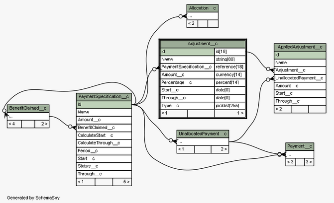

# force-metadata-jdbc-driver

## Introduction

This Java code allows a Salesforce org's schema to be exported via the wonderful [SchemaSpy](http://schemaspy.sourceforge.net/) that produces elegantly formatted ERDs linked together by web pages containing all the detail. It was originally shared via this [Google Code Project](https://code.google.com/archive/p/force-metadata-jdbc-driver/), but that moved into an archive mode in 2016.

An example diagram:



## Building

Use Ant to generate the Jar file: the script merges all the classes into one Jar file. Or use your favourite Java IDE to accomplish the same thing.

## Using

Here is how to generate the SchemaSpy output for your Salesforcr org:

* Download the [SchemaSpy jar](http://schemaspy.sourceforge.net/)
* Download and install [Graphviz](http://www.graphviz.org/) that is used by SchemaSpy to create the automatically laid out diagrams; multiple platforms including Windows and Mac are supported
* Build the Force Metadata JDBC driver jar (see previous section)
* In the folder that contains the jars just enter this (replacing the arguments that start with "My" with your own values and entering it all on one line):
```
java -cp schemaSpy_5.0.0.jar;force-metadata-jdbc-driver-2.0.jar net.sourceforge.schemaspy.Main -t force -u MyUserName -p MyPasswordAndSecurityToken -font Arial -fontsize 8 -hq -norows -o doc -db MyDbName -desc "Extracted from MyDbName"
```

The arguments are documented in the SchemaSpy web site. The only change needed for Mac/Unix is the `-cp` argument separator changing from `;` to `:`.

By default all custom objects are output. The set of objects that are output can be customized by adding a `-connprops` argument. Here is an example that outputs two standard objects in addition to all the custom objects:
```
-connprops excludes\=;includes\=Account,Contact
```
On Mac/Unix bash this would need to be:
```
-connprops excludes\\=\;includes\\=Account,Contact
```
More details of how the -connprops can be used including how to change the URL to for example connect to a sandbox org are in the original usage page. (Note that the property to achieve this is url which is in lower case.)
